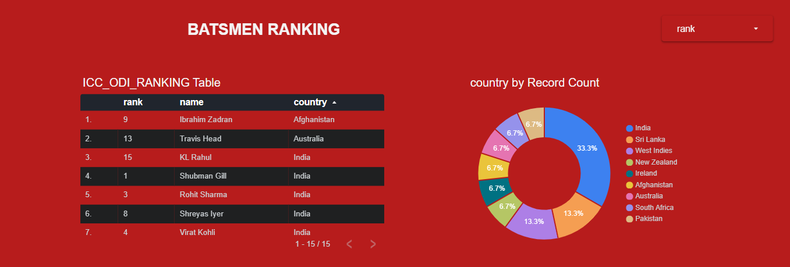

# 🏏 Cricket Stats Data Pipeline on GCP

This project demonstrates a production-grade, cloud-native data pipeline that processes ODI Batsmen Rankings (simulated from the Cricbuzz API) and visualizes insights using Looker Studio. It showcases key skills in data engineering and cloud architecture using GCP services like BigQuery, Cloud Composer, Dataflow, and more.

---

## 🚀 Project Overview

- **Data Source**: Simulated Cricbuzz API – ODI Batsmen Rankings
- **Purpose**: Build a scalable, maintainable pipeline to ingest, process, and visualize cricket stats.
- **Goal**: Showcase expertise in data ingestion, orchestration, transformation, and dashboarding on Google Cloud.

---

## 🔧 Tech Stack

| Layer         | Tools/Services Used                        |
|--------------|--------------------------------------------|
| Ingestion     | Python, Requests, Cloud Storage            |
| Orchestration | Cloud Composer (Apache Airflow)            |
| Processing    | Apache Beam, Cloud Dataflow                |
| Storage       | Cloud Storage, BigQuery                    |
| Analytics     | BigQuery SQL                               |
| Visualization | Looker Studio                              |
| Others        | Cloud Run, Eventarc (trigger handling)     |

---

## 🧩 Architecture

> 📍 Check the `architecture/architecture.png` for a detailed diagram.

**Pipeline Steps:**
1. **Ingestion (Cloud Run + Eventarc):**
   - A Cloud Run service fetches ODI batsmen rankings from a simulated API.
   - Eventarc triggers this service daily or on-demand.
   - Data is stored in Cloud Storage (`raw/` bucket).

2. **Orchestration (Cloud Composer):**
   - An Airflow DAG orchestrates the pipeline.
   - It schedules ingestion and transformation tasks.

3. **Transformation (Cloud Dataflow):**
   - Apache Beam script transforms and cleans data.
   - Output is stored in BigQuery (`processed.odi_batsmen_rankings`).

4. **Visualization (Looker Studio):**
   - Connects to BigQuery to visualize:
     - Top 10 ODI batsmen
     - Country-wise ranking trends
     - Batsmen performance over time

---

## 🗂️ Repository Structure

```

cricket-stats-data-pipeline-gcp/
│
├── README.md
├── architecture/
│ └── architecture.png # GCP pipeline diagram
│
├── dags/
│ └── cricbuzz_dag.py # Airflow DAG
│
├── dataflow/
│ └── transform_udf.js # Apache Beam script
| └── bq.json # BQ Table Schema
│
├── ingestion/
│ └── fetch_cricbuzz_data.py # API fetcher (simulated)
│
├── looker/
 └── dashboard_screenshot.png # Looker Studio dashboard image


```


---

## 📊 Sample Dashboard

> 

---

## 📝 Features Highlighted

- Fully cloud-native pipeline (serverless ingestion + scalable processing)
- Modular architecture (each layer decoupled)
- Airflow DAG handles complete orchestration
- Real-world scenario simulation with mock API
- Visualization with Looker Studio directly connected to BigQuery

---

## 💡 Use Case Extensions

- Add player performance trends over time
- Combine with bowling/fixture data
- Send ranking alerts using Cloud Functions or Pub/Sub
- Integrate with Firebase or AppSheet for a mobile app frontend

---

---

## 👤 Author

**Ketan Jain**  
_Data Engineer | GCP Certified | Python | BigQuery | Airflow | Looker_

---
